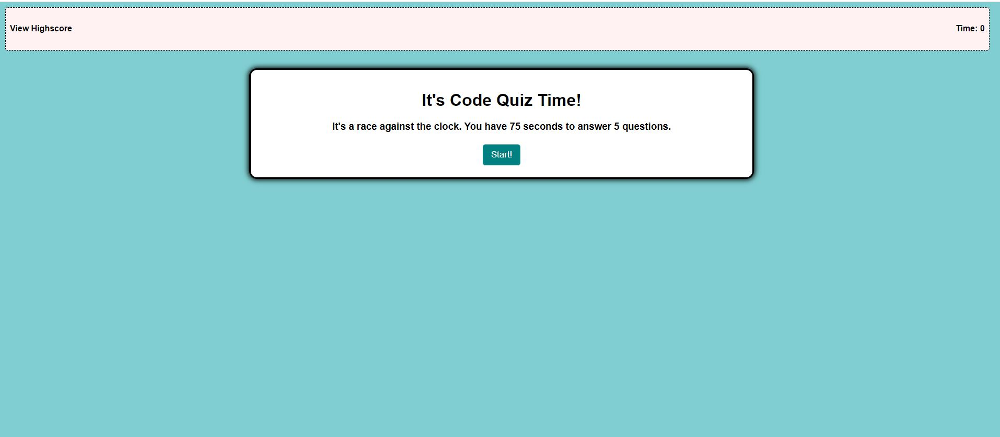

# Web API's Code Quiz

This application is a fun game that test your coding knowledge. 

Instructions:

- Press start to begin.
- You have 75 seconds to answer 5 questions.
- Answering the answer incorrectly will doc  you points. 

---
## Demo 

Website: https://jeanhern81.github.io/code-quiz/

---
## Technologies Used:

- HTML, 
- CSS, 
- JavaScript

---
## Additional Information:

- Code Validation through W3C Code Validators to check for syntax errors on the  HTML and CSS docs.

